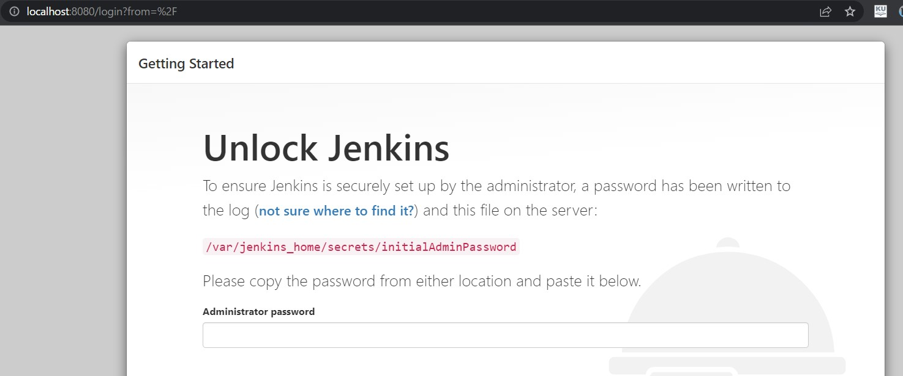
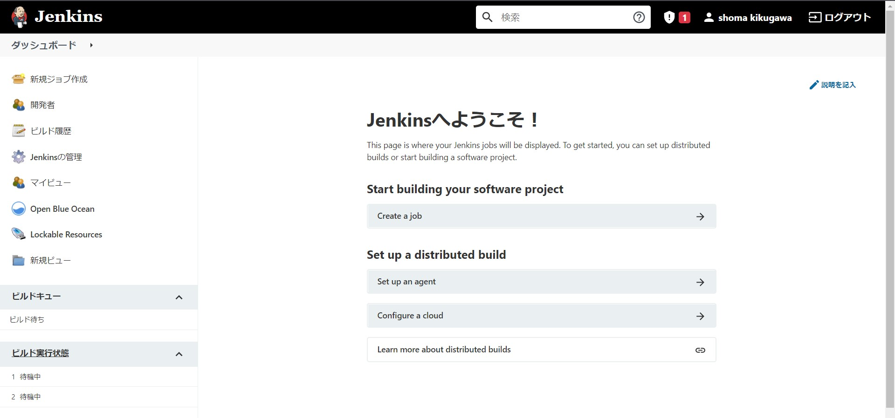
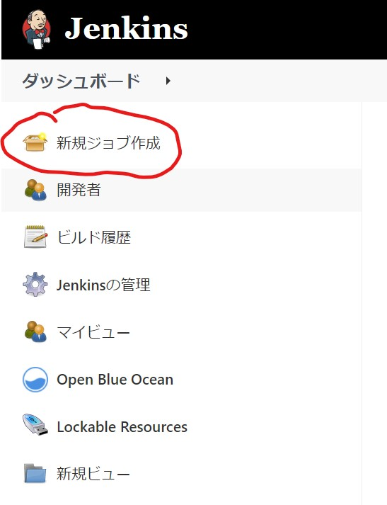
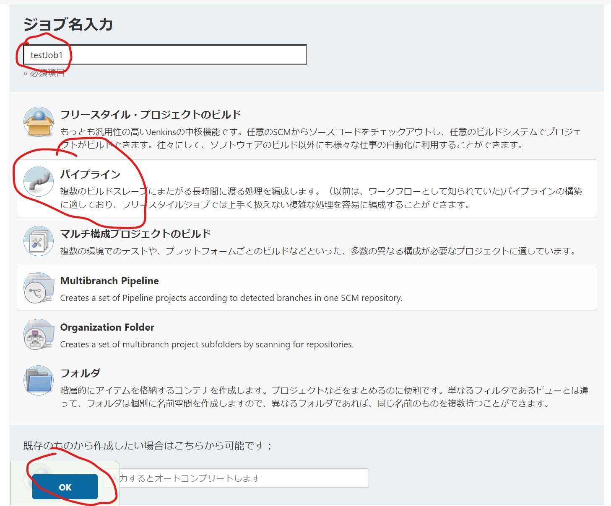
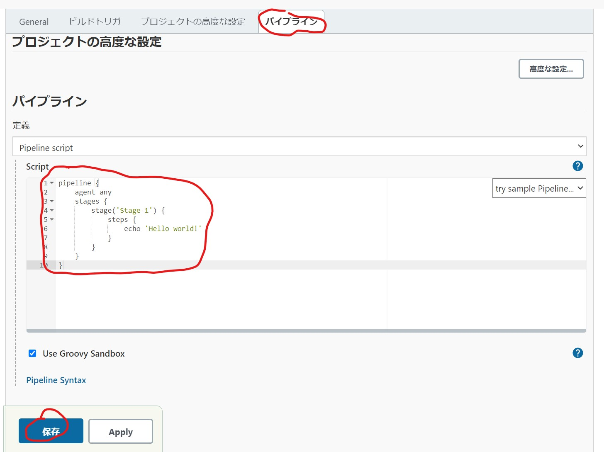
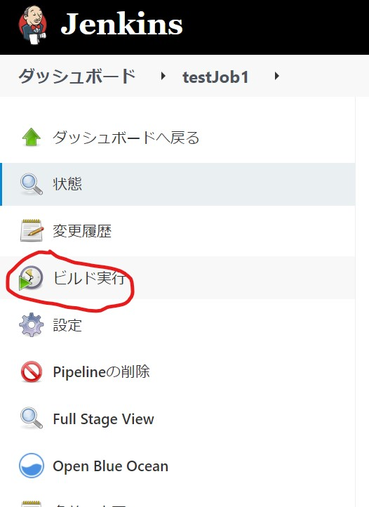
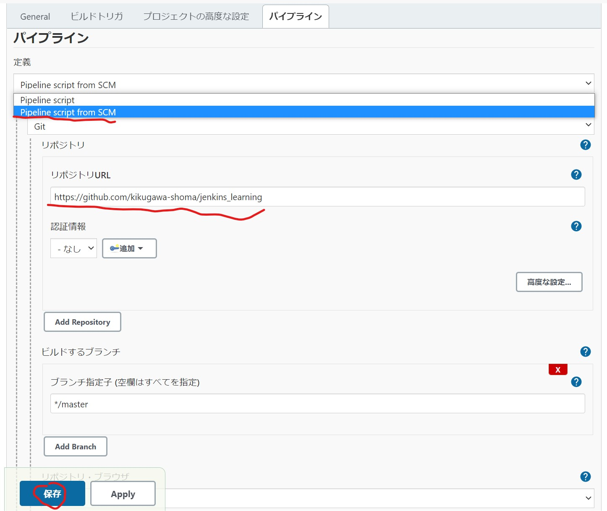

# jenkins 学習のためのリポジトリ

WSL2 上で行う

## 環境構築

https://www.jenkins.io/doc/book/installing/docker/#setup-wizard に従って行う

以下のコマンドを実行

```sh
docker network create jenkins

docker run --name jenkins-docker --rm --detach --privileged --network jenkins --network-alias docker --env DOCKER_TLS_CERTDIR=/certs --volume jenkins-docker-certs:/certs/client --volume jenkins-data:/var/jenkins_home --publish 2376:2376 docker:dind --storage-driver overlay2

docker build -t myjenkins-blueocean:2.319.3-1 .

docker run --name jenkins-blueocean --rm --detach --network jenkins --env DOCKER_HOST=tcp://docker:2376 --env DOCKER_CERT_PATH=/certs/client --env DOCKER_TLS_VERIFY=1 --publish 8080:8080 --publish 50000:50000 --volume jenkins-data:/var/jenkins_home --volume jenkins-docker-certs:/certs/client:ro myjenkins-blueocean:2.319.3-1
```

`http://localhost:8080`にアクセス。以下の表示がされれば成功



password を求められるので表示に書いてあるファイルを読んでフォームに入力

```sh
docker container exec -it jenkins-blueocean bash
cat /var/jenkins_home/secrets/initialAdminPassword
```

Install suggested plugins を選択して、ユーザー名やパスワードなどを設定して構築完了
ローカル環境ではユーザー名：developer、パスワード：developer とした。



## Pipeline

[この章](https://www.jenkins.io/doc/book/pipeline/)を読み解いていく

パイプラインの概要

- パイプラインとはアプリケーションのビルド、テスト、デプロイなどの一連のプロセスのこと。jenkins ではこのプロセスをコードにより管理・自動化できる。

- パイプラインを記述するのは Jnekinsfile。パイプライン DSL が文法

- パイプライン記述するにはふたつの文法がある
  - 宣言的方式(declarative pipeline syntax)
    スケルトン
    ```Jenkinsfile
    pipeline {
      agent any
      stages {
          stage('Build') {
              steps {
                  //
              }
          }
          stage('Test') {
              steps {
                  //
              }
          }
          stage('Deploy') {
              steps {
                  //
              }
          }
      }
    }
    ```
  - 命令的方式(scripted pipelinesyntax)
    スケルトン
    ```
    node {
      stage('Build') {
          //
      }
      stage('Test') {
          //
      }
      stage('Deploy') {
          //
      }
    }
    ```
  - 宣言的方式の方がおすすめ。（読み書きしやすいし、文法的にリッチ）

### Getting started with Pipeline

この節の目標：hello workd パイプラインの作成

- パイプラインを定義する方法は大きく 3 つ

  - Blue Ocean : Blue Ocean UI を使って Jenkinsfile を記述し、git などの VCS にコミットできる
  - classic UI : Jenkins 上の UI を使って記述（バージョン管理できないので非推奨）
  - In SCM : 自分で Jenkinsfile を書いて VCS にコミットする方法(SCM:Source Control Management)

- classic UI で Hello world してみる
  1. jenkins にアクセスして「新規ジョブ作成」をクリック
     
  2. ジョブ名を入力し、パイプラインを選択して OK をクリック(ジョブ名はそのまま jenkins システム内でディレクトリ名となるのでスペースをジョブ名に入れてはいけないことに注意)
     
  3. パイプラインタブをクリックし、以下のスクリプトを入力し保存ボタンを押す
     ```
     pipeline {
        agent any
        stages {
            stage('Stage 1') {
                steps {
                    echo 'Hello world!'
                }
            }
        }
     }
     ```
     
  4. ビルドの実行をクリック
     
- In SCM
  - VCS で Jenkinsfile を管理して Jenkins に対して Jenkinsfile の場所を教える方法
  1. Jenkinsfile を配置したリポジトリを作成する
     - 今回使用したリポジトリは[こちら](https://github.com/kikugawa-shoma/jenkins_learning)
  1. classic UI の場合と 2 の手順までは同一
  1. 以下のように設定し保存ボタンをクリック
     
  1. ビルドの実行をクリック

### using a Jenkinsfile

以下のような構成の Jenkinsfile を基に Jenkinsfile の理解を進めていく

```
pipeline {
    agent any

    stages {
        stage('Build') {
            steps {
                echo 'Building..'
            }
        }
        stage('Test') {
            steps {
                echo 'Testing..'
            }
        }
        stage('Deploy') {
            steps {
                echo 'Deploying....'
            }
        }
    }
}
```

- `agent`文は必須で、pipeline を実行するもの（executor）と wrokspace を指定するためのもの

- `stage`文と`step`文も必須で、何を実行するか、どのステージで実行するかを指定するためｎもの

#### Build

#### Test

#### Deploy
